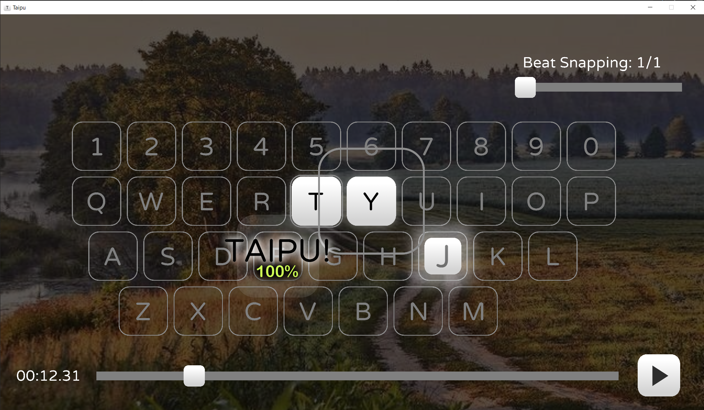
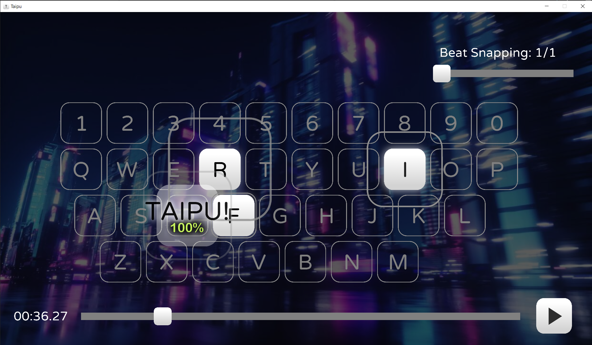

## This project is in ALPHA stage. Not finished for end user.

Project in development since February 2025 

MonoGame iteration in development since January 2026

> The game is still a work-in-progress.
> 
> Older Godot version is available in old_godot branch

Join the [Discord Server](https://discord.gg/wTtbsdbgJ2)!

## How to Use
Currently, the entire game is an editor mode. Here are the controls and tips:
- F1/F2/F3 switch editor tabs
- Select an audio file in the Meta Tab (F1)
- Press any visible key on the keyboard to create it at this beat (Set up audio sync first! Press F3 to go to an Audio Tab.)
- Right click the note to remove it
- Press F10 to save
- Use Shift or Control as modifiers for scrolling/editing BPM

## Architecture
Taipu is built with latency and stability in mind.

It's driven by the MonoGame Framework and Un4Seen BASS(with ManagedBass wrapper) 
## Key Features

- Rhythm-based typing gameplay inspired by osu! and Keyboardmania  
- Level editor for custom content   
- Optimized audio handling with ManagedBass for low latency  

## Tools and libraries used
- Visual Studio
- PaintDotNet
- Audacity
- FL Studio
- Notepad++
- ManagedBass
- NativeFileDialogSharp

All the libraries, binaries, music and content belong to their respective authors.

Taipu's code is MIT licensed.

All included UI assets (/skins/Default) are made by me and are licensed under CC BY-NC 4.0.

## Screenshots

